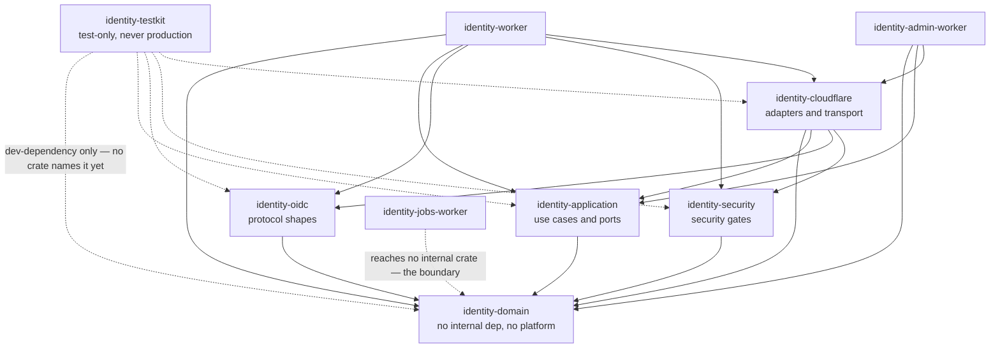

# Crate dependency law

What this document is: the Rust layering of this workspace, the permitted
dependency directions, and the reason each arrow exists.

What this document is **not**: a style guide, and not a restatement of
`Cargo.toml`. A manifest is the enforcement; this is the reasoning that tells
you which manifest edit is a mistake before you make it.

## Status

| Crate                                        | Permitted internal dependencies                                                                                                                                                           | State                                                                                                                                                                                  |
| -------------------------------------------- | ----------------------------------------------------------------------------------------------------------------------------------------------------------------------------------------- | -------------------------------------------------------------------------------------------------------------------------------------------------------------------------------------- |
| `identity-domain`                            | none                                                                                                                                                                                      | `IMPLEMENTED`                                                                                                                                                                          |
| `identity-application`                       | `identity-domain`                                                                                                                                                                         | `IMPLEMENTED`                                                                                                                                                                          |
| `identity-oidc`                              | `identity-domain`                                                                                                                                                                         | `IMPLEMENTED`                                                                                                                                                                          |
| `identity-security`                          | `identity-domain`                                                                                                                                                                         | `IMPLEMENTED`                                                                                                                                                                          |
| `identity-cloudflare`                        | domain, application, oidc, security                                                                                                                                                       | `SCAFFOLDED` — ten adapter modules written; the crate is mid-write and does not compile yet                                                                                            |
| `identity-testkit`                           | any, but only as a `dev-dependency`, and never a production dependency                                                                                                                    | `DEFERRED` — the crate is a placeholder and no crate names it yet                                                                                                                      |
| `identity-worker`                            | all of the above                                                                                                                                                                          | `DEFERRED`                                                                                                                                                                             |
| `identity-admin-worker`                      | all of the above                                                                                                                                                                          | `DEFERRED`                                                                                                                                                                             |
| `identity-jobs-worker`                       | **must reach no internal crate** — `identity-cloudflare`, `identity-oidc` and `identity-security` all pull in `identity-domain`, so naming any of them carries the rule engine in with it | `IMPLEMENTED` — the manifest names no internal crate at all, and `pnpm arch` verifies that by reachability rather than by direct edge                                                  |
| The architecture gate that judges this graph | —                                                                                                                                                                                         | `IMPLEMENTED` — `tooling/scripts/check-architecture.mjs`, run as `pnpm arch`, judges this graph from `cargo metadata` and the git index, and `pnpm arch:canary` proves the guard fires |

The dependency graph as it exists today is real: the manifests are written and
they say what this document says, and `pnpm arch` judges it on every run. What
does not exist yet is the code inside the three Worker crates and the bodies
behind the `identity-application` and `identity-security` traits.

## The graph

`identity-jobs-worker` has no edge to `identity-domain` and none to
`identity-application` — not a direct one and not one arriving through any
other crate. That absence is the point of the crate and is the subject of
[jobs-isolation.md](jobs-isolation.md).

## The arrows, and what each one is for

### `identity-application` → `identity-domain`

**The arrow exists** so that the use-case layer can ask the model questions. A
command receives a `User`, calls `user.may_authenticate()`, and decides.

**What breaks without it** (and therefore why the reverse is forbidden):
`identity-domain` would contain decisions. A rule that answers "may this user
log in?" is a rule that must be tested against a database, a clock and a
session, none of which exist in the domain crate. The moment the model answers
questions like that, the domain crate stops being a set of shapes and becomes a
set of untestable branches. Today the crate's own documentation says exactly
this: it answers "what is a User?", never "may this user log in?".

### `identity-oidc` → `identity-domain`

**The arrow exists** so a protocol message can carry a real identifier. An
`IdTokenClaims` has a `sub`, and that `sub` is a `UserId`, not a string.

**What breaks without it:** OIDC types would carry bare strings, and a `String`
that is _meant_ to be a `UserId` compiles anywhere a string compiles. The
newtype is the enforcement; the arrow is what lets the newtype be used.

**What the arrow must never become:** `identity-oidc` must not depend on
`identity-security`. The crate is not allowed to verify a signature, mint a
token, or touch a session — those belong to the security layer, and the whole
point of the split is that "what a token looks like" and "is this token valid"
are different questions owned by different crates. A protocol change must never
reach the verifier, and a verifier change must never reach the wire format. The
`jwt` module says so itself: every function there that takes a secret or a key
is absent by construction, and if you find yourself adding one, the boundary
has been crossed.

### `identity-security` → `identity-domain`

**The arrow exists** so a security gate can speak in model types. A
`TokenVerifier` returns a `SecurityError::InsufficientAssurance` carrying two
`Aal` values, not two integers.

**What breaks without it:** the security layer would define its own parallel
vocabulary for AAL and for identifiers, and the two would drift. The drift
would be silent and would show up as a security bug, not a compile error.

### `identity-cloudflare` → everything above it

**The arrow exists** because the adapters are the only place that knows a
platform. D1, Queues, the `worker` crate, HTTP status mapping: all of it is
here, and none of it is above this line.

**What breaks without it** (why the other direction is forbidden): a use case
that reached for a D1 query would be untestable without a database. The
application crate's tests run with no platform and no database at all, and that
is a deliberate property, not an accident of the phase. If a use case needs a
D1 handle, the use case is wrong; it needs a trait, and the trait belongs in
`identity-application` with its implementation in `identity-cloudflare`.

The application crate's `error` module states the same boundary from the other
side: `ApplicationError` deliberately holds **no** HTTP status code, and the
transport mapping lives in `identity-cloudflare`, because only that crate knows
what the surrounding protocol is. An error type that carried its own status
would be an error type every transport would have to agree with.

### Workers → everything

The three Worker crates are composition roots. They may name the `worker` crate
and the binding names, because that is what wiring _is_. They may not contain
policy.

**What this prevents:** the health routes, the OIDC route table, the error
envelope and the request-id plumbing come from `identity-cloudflare`, so the
Identity and Admin Workers cannot drift apart on any of them. If each of those
two assembled its own router, a fix to the error envelope would land in one and
not the other, and the two would disagree about what a 500 looks like. The
Identity Worker's manifest says this in its own comment.

**The Jobs Worker is the exception, and the exception is the point.** It is
also a composition root, and it is forbidden from reaching the crates that own
those shared types — so it carries its own copies of the envelope and the
response headers. Two of the three Workers are kept in step by a shared crate;
the third is kept in step by a test and by
`contracts/shared/v1/error-envelope.schema.json`, which is the authority for
all three. The duplication is a known, bounded cost, and removing it requires
splitting the wire types into a crate that does not reach `identity-domain` —
not relaxing the boundary.

### `identity-jobs-worker` → nothing that reaches `identity-domain`

**The arrow exists in no form, and the gate proves it.** The Jobs Worker's
manifest names `worker`, `serde` and `serde_json` and nothing internal. That
is not an oversight in the graph: it is the boundary, expressed as an absence.

The dependency is forbidden because a background worker that can evaluate
identity rules can make identity decisions, and a queue message is not a
trustworthy caller. The Jobs Worker's manifest is explicit that the absence is
the architecture and not an oversight, and it names the exact sentence that
starts the erosion: "it only needs the `User` type". See
[jobs-isolation.md](jobs-isolation.md) for the full argument, including why a
direct-edge reading of this rule is a false negative.

**What it costs.** The Jobs Worker does not get to share the error envelope or
the response builder the other two deployables use, so its route table, its 501
envelope and its health payload live in its own crate. That duplication is a
real cost and is the price of the isolation rather than a workaround for it.

**The durable fix** is to split the wire types and the error vocabulary out of
`identity-cloudflare`, `identity-oidc` and `identity-security` into a crate that
depends on `identity-domain` through nothing, and let all three Workers depend
on that one. Until it exists, the duplication is what compliance costs, and
`pnpm arch` will keep the graph honest in the meantime.

### `identity-testkit` → anything

**The arrow exists** because a test needs to build a `User` the way a test
builds a `User`, not by reaching through three crates' constructors.

**The one rule:** it is a `dev-dependency` and never a production dependency. A
testkit in a production dependency graph is a way to fabricate a valid object
outside the system's own validation, which is a privilege-escalation primitive
wearing a convenience's clothes.

## Four rules a reviewer can check mechanically

1. **`identity-domain` names no internal crate and nothing platform-shaped.** No
   `worker`, no D1, no Cloudflare type. Its manifest comment says the check is
   judged from `cargo metadata`.
2. **`identity-application` names only `identity-domain`.** Not
   `identity-oidc`, not `identity-security`, not `identity-cloudflare`. Not
   `identity-testkit`.
3. **`identity-jobs-worker` reaches neither `identity-domain` nor
   `identity-application`** — by any route, not just a direct one. This is the
   one most likely to be broken by a well-meaning "I just need the error type"
   edit, because every crate it might reach the error type _through_ depends on
   `identity-domain`. `pnpm arch` walks reachability for exactly this reason.
4. **Nothing reaches the frontends.** `crates/**` and `apps/*/worker/**` may not
   import from `apps/*/web/**`. The BFF is a boundary, not a shared library. A
   shared TypeScript type between a Vue app and its Worker would put browser-
   reachable code on the server side of a trust line.

The gate is `pnpm arch`, and it should also have a canary — a fixture tree that
violates the law in the exact ways these documents forbid, which must fail with
the exact violations. Never weaken a constraint, widen a fixture's tolerance, or
add a suppression to make a gate green. If the law is wrong, change the document
and the table together, in the open, with an ADR. Fixing the code to satisfy the
gate is the correct direction; the reverse is sabotage.

## The workspace-level bar

Every crate inherits the workspace lints through `[lints] workspace = true`:
`unsafe_code = "forbid"`, clippy `all` denied, clippy `pedantic` warned, and
`#![deny(missing_docs)]` at each crate root.

A crate that genuinely needs to escape one of these writes its own `[lints]`
table, which makes the escape a visible diff. A per-crate `#[allow]` needs a
`reason = "..."` and an explanation, and a reviewer will ask what it is
suppressing. This is not bureaucracy; it is the same idea as every other
boundary here — make the exception visible so that a reader does not have to
guess whether there was one.

## Related

- [jobs-isolation.md](jobs-isolation.md) — the dependency absence that is a
  boundary.
- [worker-architecture.md](worker-architecture.md) — what the composition roots
  do with what they are allowed to depend on.
- [admin-isolation.md](admin-isolation.md) — why a manifest omission is the
  enforceable form of a "must not".
