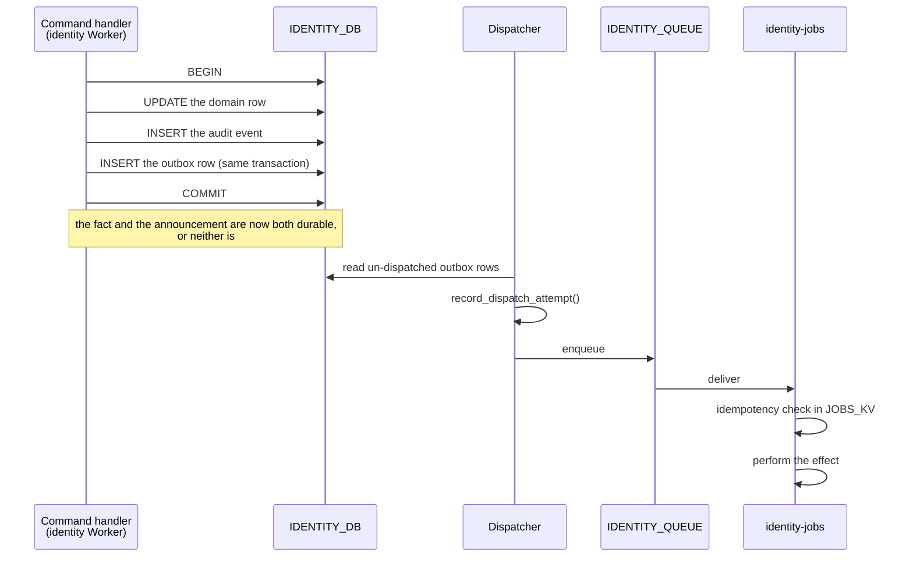

# Event model

What this document is: how a committed fact becomes a delivered side effect, why
delivery is at-least-once, and how a consumer survives seeing the same message
twice.

What this document is **not**: a queue configuration reference, or a schema
reference. The event payloads belong to `contracts/events/v1/`, and the queue is
`IDENTITY_QUEUE`.

## Status

| Fact                                                                       | State                                                                                                                                                                                                    |
| -------------------------------------------------------------------------- | -------------------------------------------------------------------------------------------------------------------------------------------------------------------------------------------------------- |
| The `outbox_events` table's shape (`identity-domain::outbox::OutboxEvent`) | `IMPLEMENTED` as a type                                                                                                                                                                                  |
| The three event type names and their version suffix                        | `IMPLEMENTED` as constructors                                                                                                                                                                            |
| `OutboxEvent::MAX_DISPATCH_ATTEMPTS` = 25 and `should_dispatch()`          | `IMPLEMENTED`                                                                                                                                                                                            |
| `OutboxEventType::parse` refusing an unversioned type                      | `IMPLEMENTED`                                                                                                                                                                                            |
| The outbox table and its migrations                                        | `DEFERRED`                                                                                                                                                                                               |
| The producer (writing the outbox row in the state transaction)             | `DEFERRED`                                                                                                                                                                                               |
| The dispatcher (claiming un-dispatched rows and enqueuing)                 | `DEFERRED`                                                                                                                                                                                               |
| The Jobs Worker's queue consumer                                           | `DEFERRED` — the Worker is a placeholder                                                                                                                                                                 |
| The consumer's idempotency contract                                        | `DEFERRED` — the sequence below is the contract; **no trait for it exists yet**. `identity-security`'s gates cover factors, tokens, PKCE, nonce, CSRF and the cipher, and idempotency is not among them. |
| `EMAIL_PROVIDER` and the email send                                        | `DEFERRED` — explicitly deferred                                                                                                                                                                         |
| `contracts/events/v1/` payload schemas                                     | `DEFERRED`                                                                                                                                                                                               |
| The consumer/producer backward-compatibility rule                          | `PLANNED` — decided; nothing to enforce it yet                                                                                                                                                           |

Nothing is delivered. No event has been produced, queued, or consumed. This
document describes a decided design and a partly-built vocabulary.

## The three event types

Three constructors exist in `identity-domain`, and the names are the contract:

| Constructor                                   | Wire value                          | What it is for                                                                  | State                                    |
| --------------------------------------------- | ----------------------------------- | ------------------------------------------------------------------------------- | ---------------------------------------- |
| `OutboxEventType::email_send_v1()`            | `identity.email.send.v1`            | An email to deliver                                                             | Producer `DEFERRED`, consumer `DEFERRED` |
| `OutboxEventType::security_notification_v1()` | `identity.security.notification.v1` | A security-relevant notice (a new factor enrolled, a session revoked elsewhere) | `DEFERRED`                               |
| `OutboxEventType::audit_archive_v1()`         | `identity.audit.archive.v1`         | Move a settled audit record to cold storage                                     | `DEFERRED`                               |

The constructors exist so that a consumer's match arm and a producer's write site
cannot drift apart by typo. Both spell the string through the same function.

## The transactional outbox

The problem it solves: a state change and the announcement of that change must
either both happen or neither happen, and they go to two different systems (D1
and a queue). Writing the queue first and the row second loses the event if the
process dies between them; writing the row first and publishing second leaves an
undelivered event that nothing will ever retry.

The outbox is a third table written in the same transaction as the state change.

The write is a **transactional outbox**, not an application-level one. There is
no distributed transaction and no two-phase commit; the point is that the
_decision_ to publish is committed atomically with the fact, and the _act_ of
publishing is retried until it succeeds. The queue is the unreliable edge, and
the retry is what makes it reliable.

Two things the producer must never do, and why:

- **The producer must not publish.** It writes a row and returns. If the
  producer published directly, a failure between the commit and the publish
  loses the event permanently, and there is nothing to find.
- **The producer must not write `dispatch_attempts`.** That column belongs to
  the dispatcher. If a command could increment it, a command that failed to
  publish would advance the retry counter itself, and a misconfigured queue
  would exhaust its budget without the dispatcher ever having tried.

## At-least-once, and why it is the only honest option

The queue delivers a message **at least once**. A consumer will see duplicates.
This is not a defect to be engineered away in the transport; it is the
guarantee the transport actually offers, and the design takes it as given.

At-most-once is available (acknowledge before processing) and it is wrong here:
a message lost to a process crash between the ack and the work is an email that
was never sent and no record that it was never sent. The failure is invisible.
At-least-once makes a duplicate visible and recoverable, and it makes a crash
recoverable as a retry. Duplicate delivery is a solvable problem; invisible loss
is not.

The Jobs Worker therefore **assumes every message may be a repeat**. A message
it has already handled is not an error; it is a fact about the transport. The
`AlreadyRedeemed` variant in `identity-security`'s error vocabulary is the same
idea at the credential level: single-use is a property, and a replay is its own
outcome rather than another wrong code.

## Consumer idempotency

The contract: **for a given event id, the observable effect happens at most
once.**

### The event id is the idempotency key

`OutboxEvent.id` is a UUID minted at write time, and it _is_ the key. The
consumer records the ids it has processed; the producer never has to tell it
which ones were retries, because the id is the same either way.

This is why the outbox row's id is not a database surrogate. A surrogate
`bigint` would differ between the original write and a re-dispatch of the same
fact, and the consumer would have no way to recognise the repeat. The UUID
travels with the message, so a redelivery is byte-identical to the original.

### The sequence a consumer follows

1. Receive a message. Parse the envelope: the event id, the event type, the
   payload, the occurred-at timestamp.
2. Refuse an envelope whose `event_type` has no `.vN` suffix or whose version
   this consumer does not implement. Do not process a version you do not
   understand; count it and move on. `OutboxEventType::version()` returns `0`
   for an unparseable suffix and no consumer supports version 0, so a malformed
   type surfaces as unsupported rather than as a plausible version binding to
   the wrong schema.
3. Check the idempotency record for the event id. If the effect has already
   happened, **ack and return**. This is the duplicate path, and it is the
   common path during a redeploy.
4. Perform the effect.
5. Record the id as processed.
6. Ack.

### The ordering problem in step 4/5, stated honestly

The check in step 3 and the record in step 5 cannot both be in a transaction
with the effect, because the effect is an outbound call to a third party and is
not transactional with anything. So the consumer has to choose which failure it
prefers:

- **Record first, then effect** (at-most-once in practice): a crash between the
  two loses the effect forever. A user never receives a security notice.
- **Effect first, then record** (at-least-once in practice): a crash between the
  two causes a duplicate on the next delivery. A user receives the same security
  notice twice.

For this system the second is correct. A duplicate security notice is a
support ticket; a silently dropped one is an incident where a user is not told
their session was revoked. So the record follows the effect, and the window
between them is narrow and accepted.

For an event whose effect is _itself_ idempotent, the window closes. An
`audit.archive.v1` that copies a settled row to cold storage is naturally
idempotent, and the two-orders question does not arise. The dangerous case is
only the outbound side effect — the email.

**This ordering is not yet expressed as a gate.** `identity-security` has traits
for `OtpService`, `TotpService`, `PasskeyService`, `RecoveryCodeService`,
`TokenSigner`, `TokenVerifier`, `SessionService`, `PkceService`, `NonceService`,
`CsrfService` and `SecretCipher` — and none of them is about consumer
idempotency. If the sequence above is to be a reviewable interface rather than a
convention inside one Worker, it needs a new trait, and that is a decision for
the phase that writes the consumer rather than something to assume into
existence.

### `JOBS_KV` is a cache here, not a source of truth

The idempotency record lives in `JOBS_KV`, which is **not authoritative**. A
`JOBS_KV` record that is lost or stale means a duplicate email, not a lost
account. That is the right trade for this data, and it is worth being explicit
about why the same argument does _not_ apply to identity state: the outbox row
in D1 _is_ the record of the fact, and D1 is authoritative. `JOBS_KV` caches the
consumer's own progress against that row; it is not a second copy of the fact.

If the idempotency record must never be lost, the answer is not "make `JOBS_KV`
authoritative" — that would mean giving the Jobs Worker a database, which
[jobs-isolation.md](jobs-isolation.md) explains is the wrong direction. The
answer is that the fact is already durable in the outbox row, and the consumer's
record is a cache of the consumer's own progress, not of the fact.

## The retry ceiling

`OutboxEvent::MAX_DISPATCH_ATTEMPTS` is 25. A dispatcher calls
`should_dispatch()` before it enqueues; past the ceiling the row is
dead-lettered rather than retried forever, and `record_dispatch_attempt` on an
exhausted row returns `DomainError::IllegalTransition` so the dispatcher bug is
visible rather than silent.

The number is a judgement between two bad outcomes, and both are named in the
domain crate's own comment: the ceiling is long enough to outlast a weekend of a
queue being misconfigured, and short enough to fail in hours rather than days. An
email that arrives three days late is a support incident. An unbounded retry is
worse than a visible dead letter, because the dead letter can be replayed
deliberately and the unbounded retry cannot.

A dead letter is **not** silently dropped. It is a row in `outbox_events` with
`dispatch_attempts = 25`, and it is queryable. Replaying a dead letter is an
operator action, deliberately, on a row someone looked at.

## Backward compatibility between producer and consumer

Constraint 22: **queue producer and consumer are backward-compatible with each
other.**

In the same way the schema is forward-only, the event contract is additive:

- A **new version** is a new type name: `identity.email.send.v2`. The v1
  consumer keeps working because it still receives v1 events, and the v2
  consumer is introduced when its consumer is deployed. The version in the name
  is the whole mechanism.
- A **new optional field** within a version is additive and safe, for the same
  reason a new nullable column is safe: the other side ignores what it does not
  know.
- A **removed or renamed field**, a **reused name with a new meaning**, or a
  **changed type** is not backward-compatible and needs a new version.

The version suffix is not decoration. It is the only thing that lets a producer
and a consumer be deployed on their own schedules, which they must be: the
Identity Worker and the Jobs Worker are separate deployables, promoted
separately, and the production canary ladder means a new Identity version can be
at 1% traffic while the Jobs Worker is still the previous one. A contract
without versions cannot survive that window.

## What a consumer must not do

| Must not                                | Why                                                                                                                       |
| --------------------------------------- | ------------------------------------------------------------------------------------------------------------------------- |
| Publish to the queue                    | A loop with no owner. See [jobs-isolation.md](jobs-isolation.md).                                                         |
| Treat a duplicate as an error           | Duplicates are the normal case under at-least-once. A consumer that dead-letters a duplicate drops real work.             |
| Assume the message is authentic         | A message is untrusted input. The security question is structural validity, which a hostile publisher satisfies for free. |
| Process a version it does not implement | The whole point of the version suffix. An unknown version is counted and skipped, not guessed at.                         |
| Record its progress as identity state   | The idempotency record is a cache. See above.                                                                             |
| Evaluate an identity rule               | It has no vocabulary to do so with, on purpose. See [jobs-isolation.md](jobs-isolation.md).                               |

## Related

- [data-model.md](data-model.md) — the `outbox_events` table.
- [jobs-isolation.md](jobs-isolation.md) — why the consumer cannot be trusted
  and cannot reach identity state.
- [../operations/observability.md](../operations/observability.md) — what the
  dispatcher and the consumer log.
