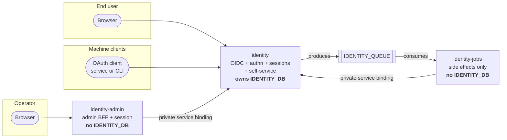

# Architecture overview

What this document is: the system in one page — the three deployables, the
request paths through them, and which component owns what.

What this document is **not**: the detailed reasoning. The trust lines are in
[trust-boundaries.md](trust-boundaries.md), the bindings are in
[worker-architecture.md](worker-architecture.md), the negative boundaries have
their own documents, and the decisions have ADRs.

## Status

Everything in the request-path section below is `DEFERRED` **except** the two
health probes. The `identity` Worker is real and dispatches; the other two
Worker crates are one-line placeholders. This document describes a shape that is
decided and, for the `identity` Worker, partly built; the status table says so on
every row.

| Component                                              | State                                                                                                                                                                                                                        |
| ------------------------------------------------------ | ---------------------------------------------------------------------------------------------------------------------------------------------------------------------------------------------------------------------------- |
| The domain model (`identity-domain`)                   | `IMPLEMENTED`                                                                                                                                                                                                                |
| The OIDC route table and wire shapes (`identity-oidc`) | `IMPLEMENTED` as data                                                                                                                                                                                                        |
| The application-layer command and query traits         | `SCAFFOLDED` — traits with no bodies                                                                                                                                                                                         |
| The security gates (`identity-security`)               | `SCAFFOLDED` — traits with no bodies                                                                                                                                                                                         |
| The platform adapters (`identity-cloudflare`)          | `SCAFFOLDED` — ten adapter modules are written (D1, KV, Queues, rate limiting, request, response, error, secrets, clock, ids); the crate is mid-write, does not compile yet, and its `crypto` module is declared but absent. |
| `identity` Worker                                      | `IMPLEMENTED` — the `fetch` entrypoint, the route dispatch, the two probes and the 501 surface. No flow behind any of the protocol routes.                                                                                   |
| `identity-admin` Worker                                | `DEFERRED` — placeholder                                                                                                                                                                                                     |
| `identity-jobs` Worker                                 | `DEFERRED` — placeholder                                                                                                                                                                                                     |
| `apps/identity/web`                                    | `SCAFFOLDED` — written and building; renders deferred states                                                                                                                                                                 |
| `apps/identity-admin/web`                              | `SCAFFOLDED` — written and building; renders deferred states                                                                                                                                                                 |
| Identity D1 schema                                     | `DEFERRED` — the forward-only rule is decided; the migrations are being written                                                                                                                                              |

## The system

Ecoma Identity is the identity plane for the Ecoma organisation. One service owns
users, identities, sessions, authenticators and OAuth/OIDC applications, and
answers one question for every other Ecoma repository: **who is this request made
by?**

It is not a business authorization service, not a user directory other systems
read for permissions, and not a session store other systems copy from. Identity
decides who someone is. What they may do in Archkeep, Loom, Release Craft or
Action Agents is decided in those systems, from their own data. A `PlatformRole`
in this repository says what an _administrator_ may do to an **account**; it is
never consulted about a merge.

## The three deployables



| Deployable       | Public surface                                                     | State it owns | Reaches identity by            |
| ---------------- | ------------------------------------------------------------------ | ------------- | ------------------------------ |
| `identity`       | OIDC routes, self-service routes, `/health`, `/ready`, its web app | Everything    | It _is_ identity               |
| `identity-admin` | Its own session, its own web app                                   | Nothing       | The `IDENTITY` service binding |
| `identity-jobs`  | **None** — no public route at all                                  | Nothing       | The `IDENTITY` service binding |

## The request paths

All `DEFERRED`. This is the shape the routes will take, not behaviour that
exists.

### 1. An OAuth client starts an authorization code flow

```
client  → GET  /oauth/authorize?...&code_challenge=...&code_challenge_method=S256
        ← 200 (the sign-in UI, served from ASSETS)
user    → enters a credential
        → POST the verification
        ← 302 to the registered redirect_uri, with ?code=...&state=...
client  → POST /oauth/token  (code, code_verifier, client authentication)
        ← 200 (access_token, id_token, refresh_token)
```

The properties that make this safe, and where each is decided:

- `code_challenge_method=S256` only. `SUPPORTED_CODE_CHALLENGE_METHOD` is
  `"S256"` and the discovery document advertises only that; the implicit flow
  and `plain` are not advertised.
- The `redirect_uri` is compared exactly, against the registered set.
  `Application::allows_redirect_uri` is a comparison, never a prefix or a glob.
- The registered `redirect_uri` must be absolute, must be `http://` or
  `https://`, must carry no fragment, and is at most 2048 bytes — enforced by
  `Application::add_redirect_uri`.

**Every route in this flow is `DEFERRED`, and is contracted to answer 501 once
a Worker exists to serve it.** Nothing serves them today. See
[worker-architecture.md](worker-architecture.md) for the 501 contract.

### 2. An end user signs in and manages their own account

```
browser → GET  /                      (the web app, from ASSETS)
        → POST /api/session           (sign in; a command, not an OAuth flow)
        ← 200 + Set-Cookie: session; HttpOnly, Secure, SameSite=Lax
        → GET  /api/account           (every call is credentials: "include")
        → POST /api/account/email     (a change command)
        → GET  /api/sessions          (list; revoke one, or revoke all)
        → POST /api/logout
```

The token never reaches `localStorage` or readable JavaScript. The session
cookie is `HttpOnly` + `Secure` + `SameSite=Lax`; CSRF protection is a server
responsibility through the `CsrfService` gate, and the `navigator.sendBeacon`
path used by single-page apps still carries the CSRF token.

### 3. An operator administers an account

```
browser → GET  /admin                 (the admin web app, from its own ASSETS)
        → POST /admin/session         (the ADMIN Worker's own session, AAL2)
        → GET  /admin/api/users?...   (a search query over the service binding)
        → POST /admin/api/users/:id/role
        → POST /admin/api/users/:id/suspend
        → GET  /admin/api/audit?...

ADMIN  ──IDENTITY service binding──▶ identity
                                    ├─ re-derives the actor
                                    ├─ evaluates the rule (identity-application)
                                    ├─ writes the state
                                    └─ writes the audit event
                                     in the same transaction
```

There is no database on the Admin Worker's side of this. Every arrow into
identity state is a typed application-layer command evaluated inside the
Identity Worker. Full argument: [admin-isolation.md](admin-isolation.md).

### 4. Identity commits a fact; a background effect follows

```
identity → writes the state change AND an outbox row, in ONE transaction
         → dispatcher enqueues  IDENTITY_QUEUE
         → identity-jobs receives the message (at-least-once; it will see it twice)
         → identity-jobs checks its idempotency record in JOBS_KV
         → identity-jobs performs the effect: send the email
         → identity-jobs records the fact it did
```

The Jobs Worker evaluates no identity rule and owns no identity state; it asks
the Identity Worker over the service binding if it needs to know something.
Full argument: [jobs-isolation.md](jobs-isolation.md), guarantees in
[event-model.md](event-model.md).

### 5. Health and readiness

```
GET /health   → liveness: the process is up
GET /ready    → readiness: this instance may receive traffic
```

`/ready` is the honesty endpoint, and it reports truthfully: it answers **200**
and its body carries `ready: false` with `authentication: "not_implemented"` and
a count of zero implemented protocol routes. The 200 is what the deploy ladder's
smoke step and health gate require, and it means "this Worker is up and
answered" — not "this instance can authenticate anyone". Those are two different
claims and the body keeps them in two different fields. `identity` serves both
probes today; the other two Workers serve neither yet, because their composition
roots are placeholders.

## What each component is for

| Component              | One sentence                                                                                                                                           |
| ---------------------- | ------------------------------------------------------------------------------------------------------------------------------------------------------ |
| `identity-domain`      | What a user, identity, session, authenticator and application **are**. Shapes and pure rules. No platform, no decisions about requests.                |
| `identity-application` | What a command or query **does**: the legal transitions, the refusals, and the ports through which storage is reached.                                 |
| `identity-oidc`        | What the protocol messages **look like**. The route table, the discovery document, the request and response shapes, the JWT and JWK shapes.            |
| `identity-security`    | What questions the system must be able to ask about a credential: the factor gates, the token gates, PKCE, nonce, CSRF, the cipher. No implementation. |
| `identity-cloudflare`  | What the platform **does** with all of it: D1, Queues, KV, the HTTP transport, the error envelope, the request-id plumbing.                            |
| `identity-testkit`     | How a test builds a valid object without reaching through three crates' constructors. Never a production dependency.                                   |
| The three Workers      | Composition roots. Wiring, not policy.                                                                                                                 |

The layering in prose is [crate-dependency-law.md](crate-dependency-law.md).

## Related

- [trust-boundaries.md](trust-boundaries.md) — where the lines are and what
  crosses them.
- [worker-architecture.md](worker-architecture.md) — the binding tables.
- [admin-isolation.md](admin-isolation.md), [jobs-isolation.md](jobs-isolation.md)
  — the two negative boundaries.
- [data-model.md](data-model.md) — the entities and their tables.
- [event-model.md](event-model.md) — the outbox and delivery guarantees.
