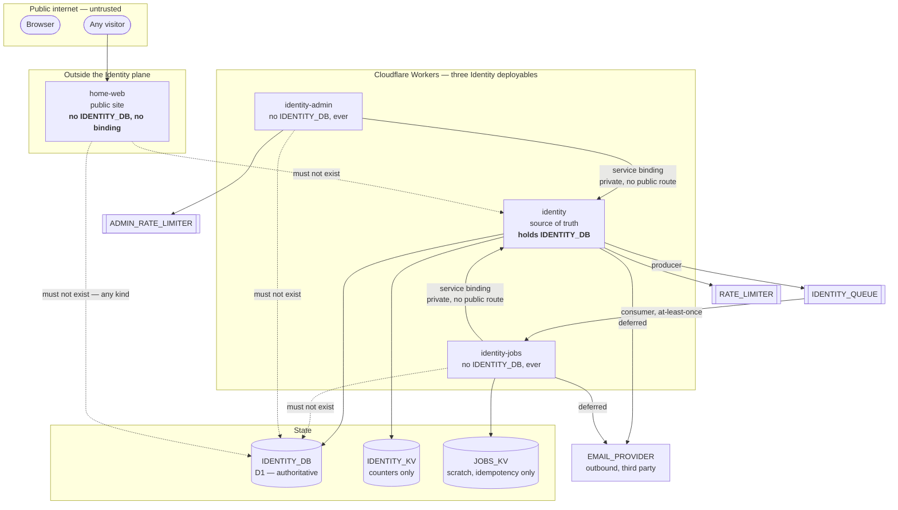

# Trust boundaries

What this document is: the map of every trust line in Ecoma Identity, what
crosses each one, and what an attacker gets on the far side.

What this document is **not**: an authorisation policy, a session policy, or a
list of role checks. Those live in
[security-constraints.md](../security/security-constraints.md) and in the code.

This is the most important document in the architecture set. If you remember
one thing from it, remember the shape: **one component holds identity state and
nothing else can reach it.** Every boundary below is a consequence of that.

The corollary is worth stating as its own rule, because it is the one a new
deployable could violate by existing: **a component outside the Identity plane
must have no edge into it at all.** Not a guarded edge, not an
authorisation-checked edge — no edge. `home-web` (ADR-0016) is the case in point;
the section on it is [§10](#10-home-web-and-the-identity-plane).

## Status

| Boundary                                                           | State                                                                                            |
| ------------------------------------------------------------------ | ------------------------------------------------------------------------------------------------ |
| Network edge (public internet to a Worker route)                   | `DEFERRED` — no Worker serves traffic yet                                                        |
| Identity Worker to Identity D1                                     | `SCAFFOLDED` — the D1 adapter module is written; the Worker that would call it is a placeholder  |
| Admin Worker to Identity Worker (private service binding)          | `DEFERRED` — both sides are placeholders                                                         |
| Jobs Worker to Identity Worker (private service binding)           | `DEFERRED`                                                                                       |
| Identity Worker to `IDENTITY_QUEUE`                                | `DEFERRED`                                                                                       |
| Jobs Worker to `EMAIL_PROVIDER` (outbound fetch)                   | `DEFERRED` — the provider is explicitly deferred                                                 |
| Browser to web app to BFF (cookie boundary)                        | `DEFERRED`                                                                                       |
| Web app to Worker `ASSETS`                                         | `DEFERRED`                                                                                       |
| Internal caller to `identity` (the `x-ecoma-internal` header path) | `PLANNED` — see the warning below                                                                |
| Visitor to `home-web`, and `home-web` to the Identity plane        | `SCAFFOLDED` — the public site renders and holds nothing; there is no edge into the plane at all |

Nothing at these boundaries is built. The boundaries are decided and the
decisions are enforced by manifest and by the architecture gate rather than by
runtime code that does not exist yet.

## The map

The two dashed edges are the ones that must never become solid. They are the
whole subject of [admin-isolation.md](admin-isolation.md) and
[jobs-isolation.md](jobs-isolation.md).

## The boundaries, one at a time

### 1. The network edge

**Where:** the public internet, in front of each Worker's public routes.

**What crosses it:** a request with no trustworthy origin, no trustworthy
identity, and attacker-chosen every header and every byte of body.

**What the far side gets:** whatever the route's handler decides to expose.
Nothing more, by construction: the handler receives an untrusted value and must
treat it as one.

**What breaks if this is violated:** everything below. There is no second
boundary behind it.

### 2. Identity Worker to Identity D1

**Where:** inside the `identity` deployable, at the `IDENTITY_DB` binding.

**What crosses it:** SQL and its parameters, on behalf of an application-layer
command.

**What the far side gets:** everything. D1 has no per-caller authorisation. Any
code that can reach this binding can read and write every row, and the rows are
the credentials.

**What breaks if this is violated:** constraint 2 of the founding list. The
single source of truth becomes a shared database, the admin surface stops
needing a service binding, and the blast radius of an Admin Worker compromise
becomes the entire user table instead of "whatever the internal endpoints
expose". There is no compensating control for this; the D1 credentials are the
whole database's read/write authority.

**Enforcement:** the binding appears in exactly one generated `wrangler.jsonc`
per environment, the `identity` one. See [worker-architecture.md](worker-architecture.md) for the
binding table and [admin-isolation.md](admin-isolation.md) for the argument that
keeps the other two off it.

### 3. Admin Worker to Identity Worker (private service binding)

**Where:** the `IDENTITY` binding on `identity-admin`.

**What crosses it:** an internal request, over a channel Cloudflare provides
between two Workers of the same account. It does not traverse the public
internet and it is not addressable from outside.

**What the far side gets:** whatever the internal endpoints on `identity`
expose. The Admin Worker is a _client_ of identity, not a peer with it.

**What breaks if this is violated:** the Admin Worker becomes a second writer to
identity state, and two writers to one table means the audit trail, the session
issuance rules and the last-administrator invariant must all be enforced twice,
once in each path. The confused-deputy argument is in
[admin-isolation.md](admin-isolation.md); the short form is that an operator
with admin rights would then be able to mutate identity rows by a route that
was never reviewed as an identity mutation route.

**A warning about the obvious "improvement".** A private service binding
authenticates _which Worker_ is calling. It does **not** authenticate _which
admin operator_ is calling, because the operator is several hops behind the
Admin Worker's own session check. Any design that lets a caller pass an actor id
in a header or a body and have `identity` trust it is a privilege-escalation
primitive: it hands every Admin Worker's own authentication the authority of an
administrator. The internal endpoints must re-derive the actor from something
the Identity Worker issued and can verify, or the service binding becomes a
confused deputy. **There is no implemented design for this yet.** It is
`PLANNED` and it is the subject of an ADR that does not exist yet; the
requirement is recorded here so that whoever writes it cannot miss it.

### 4. Jobs Worker to Identity Worker (private service binding)

**Where:** the `IDENTITY` binding on `identity-jobs`.

**What crosses it:** the same kind of private request, and the same warning
about actor identity.

**What breaks if this is violated:** the Jobs Worker can read identity state
while having no authorisation logic to decide what it may read. See
[jobs-isolation.md](jobs-isolation.md).

### 5. Identity Worker to the queue

**Where:** the `IDENTITY_QUEUE` producer binding on `identity`.

**What crosses it:** a committed fact, serialised, addressed to a consumer.

**What the far side gets:** the event body and nothing else. The queue is not a
read path and must never become a way to ask identity a question.

**What breaks if this is violated:** delivery becomes at-most-once and every
consumer grows ad-hoc de-duplication logic that is different from every other
consumer's. The contract for that is in [event-model.md](event-model.md).

### 6. Queue to Jobs Worker

**Where:** the `IDENTITY_QUEUE` consumer binding on `identity-jobs`.

**What crosses it:** a message body, possibly already delivered once.

**What the far side gets:** whatever is in the body, which is why the body is
the untrusted-input boundary. A message is not a trustworthy caller: anyone who
can publish to the queue, or any future producer, can put a payload in it.

**What breaks if this is violated:** a malformed or hostile message reaches code
that performs a real side effect. The mitigation is that Jobs may not evaluate
identity rules, which is why it has no domain vocabulary. See
[jobs-isolation.md](jobs-isolation.md).

### 7. Identity Worker to `EMAIL_PROVIDER`

**Where:** an outbound `fetch` to a third-party email API.

**What crosses it:** an email address and message content, to a processor that
is outside the trust boundary entirely.

**What breaks if this is violated:** personal data leaves the boundary. The
provider binding is `DEFERRED`; until it exists, the system sends nothing.

### 8. Browser to web app to BFF

**Where:** the `ASSETS` static boundary and the session cookie.

**What crosses it:** the session cookie, and every authenticated fetch.

**What the far side gets:** a session identifier and nothing else. The token
never reaches readable JavaScript.

**What breaks if this is violated:** any XSS in a web app becomes a full
session theft, and any CORS or CSRF hole becomes an authenticated request from a
browser the user did not intend. The rules are in
[security-constraints.md](../security/security-constraints.md).

### 9. `IDENTITY_KV` and `JOBS_KV` are not a trust boundary, they are a storage

detail

They exist, they are named, and they are **not authoritative**. A counter in KV
that disagrees with the D1 row it counts is a lost rate limit, not a lost
account. This is stated in [worker-architecture.md](worker-architecture.md) and
repeated here because "we put it in KV" is how a system quietly grows a second
source of truth.

### 10. `home-web` and the Identity plane

**Where:** nowhere. That is the finding, and it is the whole section.

`home-web` is a deployable in this repository and it is **outside** this plane.
Its only Cloudflare binding is `ASSETS`, the static-asset binding for its own
prerendered output. There is no `IDENTITY_DB`, no `IDENTITY_KV`, no
`IDENTITY_QUEUE`, and no `IDENTITY` service binding in any of its three
environment configs, and it imports no internal Identity crate or package.

**What crosses the boundary:** nothing. A visitor's `GET /` reaches `home-web`
and stops there. `home-web` holds no user, session, or authentication state,
holds no queue consumer and no audit trail, and is not an input to any
authorization decision anywhere in the organisation.

**What it is not**, and each of these is a way a public site usually ends up
coupled to an identity plane:

- Not an Identity frontend. `identity` and `identity-admin` ship their own web
  apps as part of one release unit (ADR-0015); `home-web` shares no release unit
  with either, and releases on its own `home-web-v*` tag family.
- Not a BFF. It has no Identity session to proxy and no Identity route to front.
- Not a session authority, and it authenticates nobody. A link to
  `https://identity.ecoma.io` is a link, not a binding.

**What breaks if this is violated:** if a future change gives `home-web` any
Identity binding or dependency, the public internet's most exposed deployable
becomes a door into the identity plane — and it would do so without touching any
boundary in §2–§8, because none of those are on that path. That is precisely why
the rule is enforced mechanically rather than by review: the architecture gate
refuses an Identity binding in a `home-web` config, an Identity import in
`home-web` source, and an Identity package in its `package.json`, and
`pnpm arch:canary` proves each of those refusals fires.

Decision: [ADR-0016](../adr/0016-home-web-fourth-deployable.md).

## What is deliberately not a boundary

- **Between the domain, the application layer and the adapters.** Those are
  _layers_ inside one deployable, not trust boundaries: they all run with the
  same authority. The layering exists for testability and reviewability, which
  is [crate-dependency-law.md](crate-dependency-law.md).
- **Between the two web apps.** They share no code, no session, and no origin.
  The admin web app is a separate deployable's static assets, and the fact that
  it is an admin surface is enforced by the session check, not by the network.
- **Between the three Workers as processes.** They are three isolates in one
  account. Process separation is not a security control here; the binding set
  is.
- **Between `home-web` and the Identity plane.** There is no edge to protect. It
  is not a boundary in the sense the rest of this document uses the word; it is
  the absence of one, and §10 says what keeps it absent.

## The blast radius of each mistake

| Mistake                                                     | Blast radius                                                                                                                                         |
| ----------------------------------------------------------- | ---------------------------------------------------------------------------------------------------------------------------------------------------- |
| A second component gains `IDENTITY_DB`                      | Every user, every credential, every session. Total compromise.                                                                                       |
| Admin reaches D1 for one report                             | The same, and it is the hardest to notice because the report works.                                                                                  |
| A protocol route stops answering 501                        | Clients that treat 501 as "try again later" will; a fake 200 is worse than a 501 because it is believed.                                             |
| The rate limiter becomes optional                           | Constraint 25's counterpart: a login path with no limiter is an open credential-stuffing target. See [threat-model.md](../security/threat-model.md). |
| KV is consulted before D1 for an authorisation decision     | Two sources of truth, and the fast one is the wrong one.                                                                                             |
| The internal service binding accepts an actor from a header | Any Admin Worker session becomes any administrator.                                                                                                  |
| `home-web` gains any Identity binding or dependency         | The most publicly exposed deployable becomes a door into the identity plane, by a path none of §2–§8 watches.                                        |
