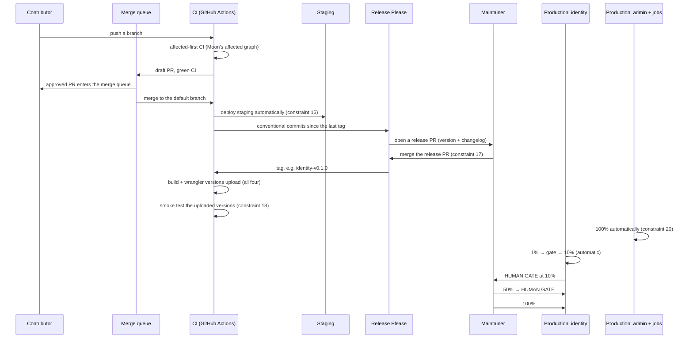

# Release process

What this document is: who does what between a merged change and traffic, and why
"released" and "deployed" are two different words with two different owners.

What this document is **not**: a CI reference. The workflow files are the
authority; this document explains the division of responsibility so a maintainer
knows which part is a decision and which part is a script.

## Status

| Fact                                                              | State                                                                            |
| ----------------------------------------------------------------- | -------------------------------------------------------------------------------- |
| Release Please owns version, release PR and tag                   | `PLANNED` — decided; the config file is `DEFERRED`                               |
| The release PR is merged by a human                               | `PLANNED` — constraint 17                                                        |
| Post-tag build, version upload and smoke test are automatic       | `PLANNED` — constraint 18; the workflow is `DEFERRED`                            |
| Staging deploys automatically after a merge to the default branch | `PLANNED` — constraint 16; the workflow is `DEFERRED`                            |
| Production promotion of `identity` needs two human approvals      | `PLANNED` — constraint 19; the workflow is `DEFERRED`                            |
| Cocogitto validates commit messages at `commit-msg`               | `PLANNED` — `cocogitto.toml` is `DEFERRED`; `package.json` does not reference it |
| A `.release-please-manifest.json`                                 | `DEFERRED` — named in the root `Cargo.toml` comment; the file does not exist yet |
| Every workflow that does any of the above                         | `DEFERRED` — `.github/workflows/` is empty                                       |

**No release has been cut. No tag exists. Nothing has been deployed.**

## The one distinction the process exists for

Constraint 9: **release ≠ deployment.** Cutting a release is not promoting it.
Constraint 10: **Release Please owns version, release PR and tag. It does not own
production promotion.**

The reason is a blast-radius argument. Version numbers and tags are cheap and
frequent; a production promotion is neither. A process that couples them forces a
choice between releasing a fix often — which is what you want, and what makes
the version number mean something — and promoting to production with the same
friction, which is what you do not want, because production promotion should be
gated on the version's own health rather than on when someone got round to cutting
it.

So there are two events with two owners, and neither one implies the other:

|                       | Release                                               | Deployment                                                            |
| --------------------- | ----------------------------------------------------- | --------------------------------------------------------------------- |
| **What it is**        | A version number, a changelog, a git tag              | A Cloudflare Deployment sending traffic to a Version                  |
| **Who owns it**       | Release Please                                        | GitHub Actions + Moon + Wrangler                                      |
| **Trigger**           | Conventional commits accumulate on the default branch | A tag, or a merge to the default branch for staging                   |
| **Human involvement** | A human merges the release PR                         | A human approves the two identity gates; admin and jobs are automatic |
| **Reversible**        | Not meaningfully — a tag is permanent                 | Yes, in seconds, by promoting an existing version id                  |
| **Frequency**         | As often as the work lands                            | As often as a release is healthy enough                               |

A release that has not been deployed is normal and not a problem. A deployment
with no release behind it is a problem, because nothing is traceable to a commit.

## Who does what

| Actor                             | Owns                                                                                                                                                                                                              |
| --------------------------------- | ----------------------------------------------------------------------------------------------------------------------------------------------------------------------------------------------------------------- |
| **Cocogitto** (`commit-msg` hook) | Validating that every commit message matches the conventional format and carries a scope from `commitlint.config.mjs`. It is the release-message authority — Commitlint is not, and the two must not be confused. |
| **Moon**                          | The task graph. Which projects are affected by a change, and therefore what CI runs (constraint 15, affected-first).                                                                                              |
| **GitHub Actions**                | Running the tasks, and the workflows themselves.                                                                                                                                                                  |
| **Release Please**                | The version number, the changelog, the release PR, and the tag. **Nothing else.**                                                                                                                                 |
| **Wrangler**                      | Uploading versions and creating deployments. It is a mechanism, not a decision-maker.                                                                                                                             |
| **A human**                       | Merging the release PR. Approving the two identity production gates. Deciding to roll back.                                                                                                                       |
| **The merge queue**               | Landing every PR. No direct merges, no direct pushes to the default branch.                                                                                                                                       |

## The sequence

Note the ordering constraint at the end: **staging deploys on merge, production
deploys on tag.** A merge to the default branch is not a production deploy, and a
tag is not a merge. They are different triggers for different environments, and
the reason is that staging deploys _automatically_ (constraint 16) while
production deploys _behind a health ladder and two human gates_ (constraint 19).
If production deployed on merge, the two constraints would be in direct
conflict.

## What is automatic, and what is not

| Step                                                 | Automatic?               | Constraint |
| ---------------------------------------------------- | ------------------------ | ---------- |
| PR CI (affected-first)                               | Yes                      | 15         |
| Merge to the default branch → staging                | Yes                      | 16         |
| The release PR is **opened**                         | Yes                      | 10         |
| The release PR is **merged**                         | **No — a human**         | 17         |
| Post-tag build, version upload, smoke test           | Yes                      | 18         |
| Production: `identity-admin`, `identity-jobs` → 100% | Yes                      | 20         |
| Production: `identity` → 1%, 10%                     | Yes                      | 19         |
| Production: `identity` → 50%, 100%                   | **No — a human, twice**  | 19         |
| A rollback                                           | **No — a human, always** | 14         |

The pattern is worth stating as a rule: **automation owns the steps whose failure
mode is a duplicate of the step above, and a human owns the steps whose failure
mode is irreversible.** Building and uploading is automatic because a human doing
it adds latency without adding judgement. Deciding that 100% of production
traffic moves to a new version is a human's job because that decision is not
reversible by promoting an older version id without another decision.

## PR CI is affected-first

Constraint 15: PR CI runs **affected-first**, using Moon's affected graph — not
`moon ci` across all 11 projects, every time.

`.moon/workspace.yml` maps 12 projects (six crates, three Workers, two web
apps, and the public home-web application), and Moon computes which of them a
change affects. A one-line comment in a Rust doc comment runs the Rust projects
and skips the web apps; a change to `pnpm-workspace.yaml` runs everything.

The reason it is not simply "run everything" is that the whole repository is
small enough to do that, and it is written so that it does not have to stay
small. An affected graph that is wrong in the direction of _under_-running is a
green check on a broken build; a graph that is wrong in the direction of
_over_-running is slow and correct. New modules must be added to
`.moon/workspace.yml` in the same commit that creates them, which is the
"new module = one commit, four files" rule in `AGENTS.md`.

## The release PR

Release Please opens it. **A human merges it** (constraint 17). This is the only
step in the sequence where automation stops and asks.

What the release PR contains: the version bump in
`.release-please-manifest.json` and the relevant `package.json`/`Cargo.toml`
files, and the changelog generated from the conventional commits since the last
tag. The changelog is generated from commit messages, so the commit message is
the user-facing artifact — which is why Cocogitto validates them and why the
scopes in `commitlint.config.mjs` are a real decision rather than a lint
setting.

**Versioning the four deployables.** The root `Cargo.toml` sets every crate to
`version = "0.0.0"` and says in a comment that this exists only to satisfy Cargo's
manifest and is **not** the deployed version of anything. Release Please owns the
four production versions (`identity`, `identity-admin`, `identity-jobs`, and
`home-web`); the internal crates are not production release units and are never
tagged. The comment cites ADR-0008 for that decision — the record lives in
`../adr/`.

## What a tag produces

A tag such as `identity-v0.1.0` produces, entirely automatically:

1. A build of the Worker, through Moon's `build` and `package` tasks, with the
   web app's `dist/` in the right directory (constraint 8: one release unit).
2. `wrangler versions upload` for all four deployables. **This changes no
   traffic.**
3. A smoke test against each uploaded version. This is what reads
   `Route::is_implemented()` and probes the routes that are supposed to answer,
   so a version that uploads but does not serve is caught here rather than after a
   promotion.
4. For `identity-admin` and `identity-jobs`: a 100% deployment. Done.
5. For `identity` and `home-web`: the canary ladder, stopping at 10% and waiting
   for a human (ADR-0016).

Everything in steps 1 through 4 is automatic. Step 5 is automatic to 10% and then
is not, and the reason is in
[deployment-model.md](deployment-model.md) under "The two human gates".

## What is _not_ in this process

- **No direct merge to the default branch.** Every PR lands through the merge
  queue. No direct push either, and commits are cryptographically signed.
- **No release that deploys.** Release Please does not call `wrangler`, does not
  know a Cloudflare account exists, and has no credentials.
- **No promotion without a version id.** A deployment always names a version that
  was uploaded; there is no path that builds and promotes in one step, because
  that path would make every promotion a rebuild and destroy the meaning of a
  version id.
- **No `--no-verify`.** Hooks run the fast gates per commit and the full suite on
  push.

## When a release is _not_ cut

Some changes should not produce a version: a comment-only change to a document,
a CI fix. Conventional commits handle this through a `!` / no-release marker or a
chore scope, depending on the config. The rule is that a **chore or docs change
that reaches the default branch does not force a version bump**; it rides along
with the next release. Forcing a version per commit makes the version number
stop meaning anything, and the version number is what makes a rollback
deciable.

## Related

- [deployment-model.md](deployment-model.md) — the Cloudflare model, the ladder,
  and the two gates.
- [rollback.md](rollback.md) — what to do when a promoted version is wrong.
- [../getting-started/first-deploy.md](../getting-started/first-deploy.md) —
  doing all of this by hand, once, with no pipeline.
- [../security/secrets-management.md](../security/secrets-management.md) — the
  CI credentials this process needs.
